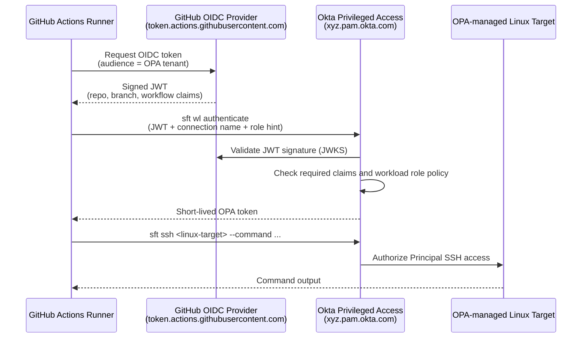
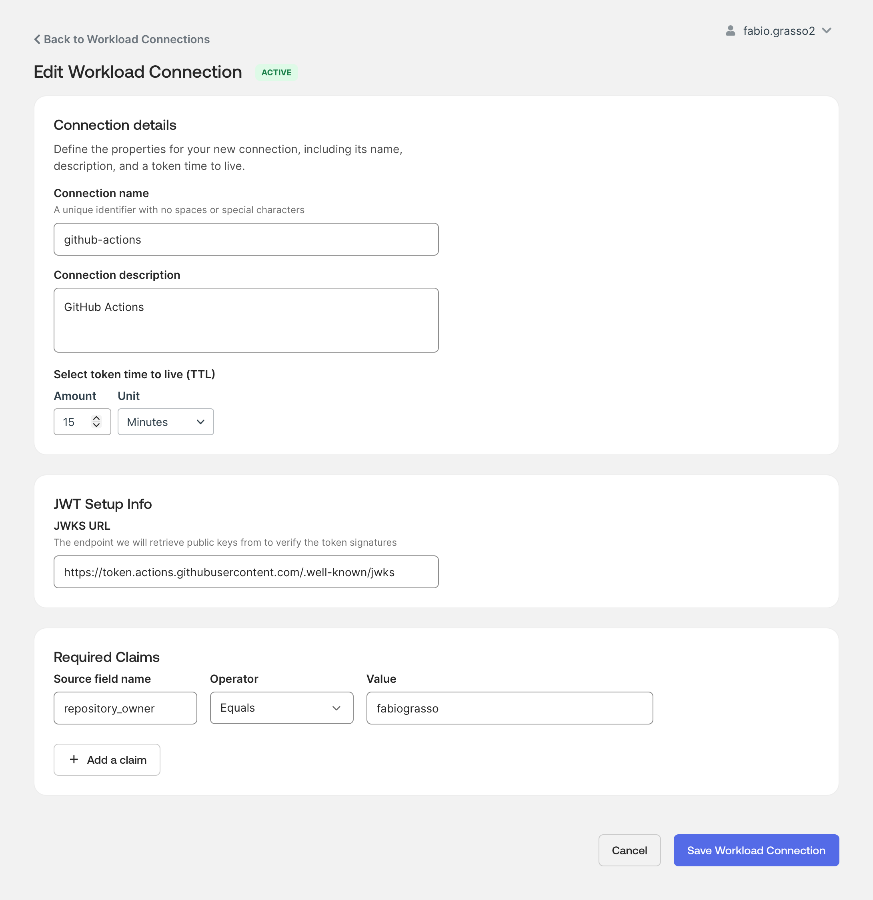
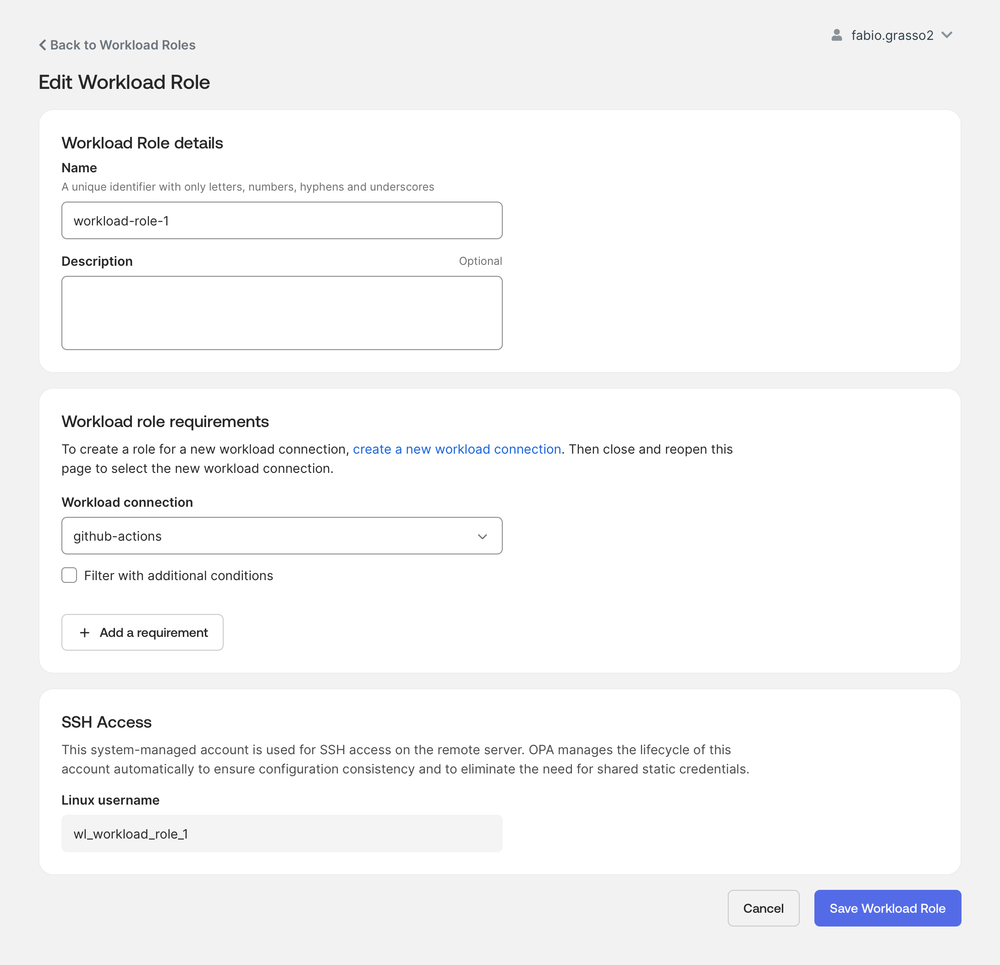
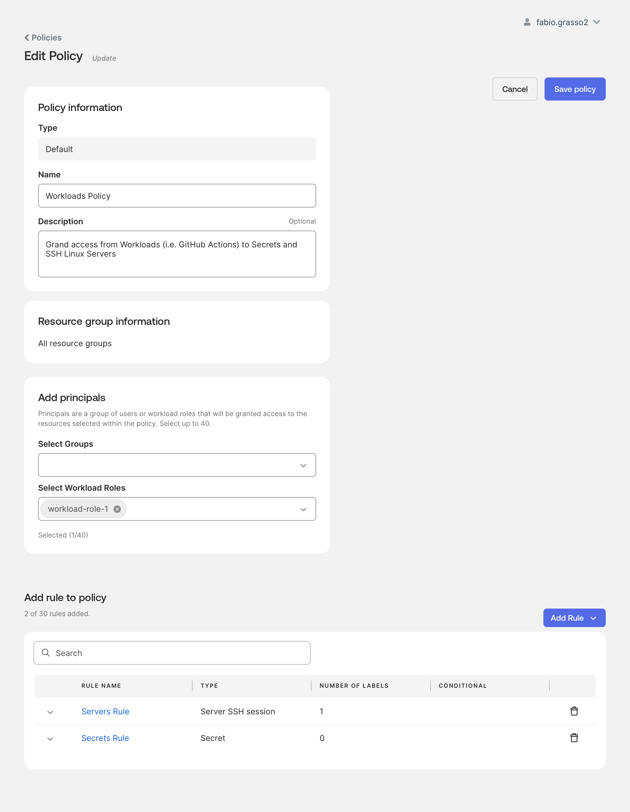
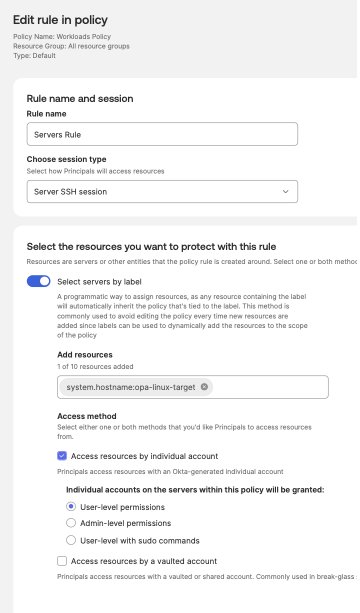
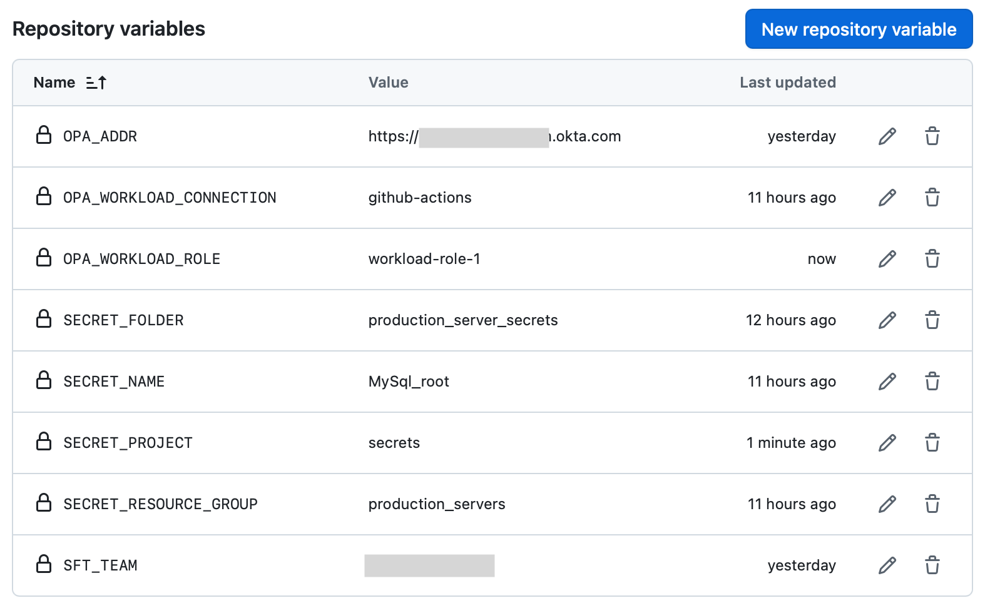

# Okta Privileged Access — Workloads SSH Lab

> **Note**: This is a lab environment for testing and demonstration purposes.

> [!CAUTION]
> **Not an Official Okta Product** - This is an independent community project and is not an official Okta product. Use at your own risk and always test in a non-production environment first.

A GitHub Actions lab that demonstrates **Okta Privileged Access (OPA) Workloads** with **Principal SSH access**. A GitHub-hosted runner authenticates to OPA without static secrets by using GitHub's native OIDC token, then runs a simple SSH command on an OPA-managed Linux target.

[](LICENSE)
[](https://github.com/features/actions)

---

## Overview

OPA Workloads provides secretless authentication for non-human identities such as CI/CD runners, service accounts, and automation jobs. Instead of storing a long-lived API key in GitHub Secrets, the GitHub Actions runner requests a short-lived OIDC token from GitHub. OPA validates that JWT, checks the configured workload connection claims, maps the workload to a workload role, and evaluates policy before allowing access.

This `main` branch intentionally focuses on the **currently working SSH use case**.

| Goal | Status | Workflow |
|------|--------|----------|
| Run an SSH test against a Linux target | Supported | [`opa-workloads-ssh-linux.yml`](.github/workflows/opa-workloads-ssh-linux.yml) |
| Run the same SSH test from a prebuilt client container | Sample only | [`opa-workloads-ssh-linux.sampledocker`](.github/workflows/opa-workloads-ssh-linux.sampledocker) |

Secret retrieval and additional workload use cases are tracked as future examples. See [Upcoming Use Cases](#upcoming-use-cases).

---

## Architecture



---

## Prerequisites

- An Okta Privileged Access tenant with Workloads enabled
- Okta DevOps Admin and Security Admin access for configuration
- A GitHub repository with Actions enabled
- An OPA-managed Linux server target
- The `sft` CLI, installed automatically by the workflow on the Ubuntu runner

For faster automation runs, this lab can also be adapted to use the companion ScaleFT client container image:

```text
ghcr.io/fabiograsso/opa-scaleft-client:latest
```

The image is maintained in [`opa-scaleft-docker`](https://github.com/fabiograsso/opa-scaleft-docker). The Docker sample in this repo is intentionally not executable by GitHub Actions because it is named `.sampledocker`, not `.yml`.

---

## OPA Configuration

### 1. Workload Connection

Navigate to **Okta Privileged Access → Access → Workloads → Connections** and create a GitHub Actions workload connection.

| Field | Value / Example |
|-------|-------|
| **Provider** | Github Actions |
| **GitHub Org/Owner** | `xyz` your GitHub organization or user |
| **Connection name** | `github-actions` |
| **Token time to live (TTL)** | `15 minutes` *(default)*  |
| **JWKS URL** | `https://token.actions.githubusercontent.com/.well-known/jwks` *(default)* |
| **Required Claims** | `repository_owner EQUALS xyz` *(default)* |



For a stricter lab, add one or more GitHub OIDC claims:

| Scope | Claim | Example value | Notes |
|-------|-------|---------------|-------|
| GitHub owner | `repository_owner` | `xyz` | Allows repositories owned by the `xyz` GitHub user or organization |
| One repository | `repository` | `xyz/okta-lab-workloads` | Restricts access to this lab repository |
| One branch | `ref` | `refs/heads/main` | Restricts access to workflow runs from the `main` branch |
| One workflow subject | `sub` | `repo:xyz/okta-lab-workloads:ref:refs/heads/main` | Combines repository and branch in one claim |

For a simple lab it's okt the default claim of `repository_owner EQUALS xyz`, which allows any workflow from any repository owned by `xyz`. For better security, add the `repository` claim to restrict to a specific repository, and optionally the `ref` claim to restrict to a specific branch. The most secure option is to use the full `sub` claim, which combines repo and branch in one claim and cannot be bypassed by token manipulation.

After creation, the connection starts in **Draft**. A Security Admin must activate it before the workflow can authenticate successfully.

### 2. Workload Role

Navigate to **Okta Privileged Access → Access → Workloads → Roles** and create a workload role bound to the connection above. This role becomes the principal used by OPA policy.

You can name it for example `workload-role-1`.



### 3. Policy Binding

Create (or update) a policy under **Okta Privileged Access → Policies**:

- Name: `GitHub Actions Workloads Policy` (or similar)
- Add the workload role as principal under **Select Workload Roles**
- Do **not** enable MFA or Access Requests — a headless workload cannot respond to them
- Add a **Server SSH session rule** granting access to your target server (i.e. `opa-linux-target`). Optionally, enable the Gateway for SSH access if your target is behind an OPA gateway.
- Publish the policy



Server SSH rule example:



---

## GitHub Actions Variables

All configuration is done with GitHub Actions **Variables**. No static OPA secrets are required.

| Variable | Required | Description | Default / Example |
|----------|----------|-------------|-------------------|
| `OPA_ADDR` | Yes | OPA tenant URL | `https://xyz.pam.okta.com` |
| `SFT_TEAM` | Yes | OPA team name | `xyz` |
| `OPA_WORKLOAD_CONNECTION` | No | Workload connection name | `github-actions` |
| `OPA_WORKLOAD_ROLE` | No | Workload role name | `workload-role-1` |
| `OPA_LINUX_TARGET` | No | Linux target name for the SSH test | `opa-linux-target` |



> [!WARNING]
> This lab workflow prints decoded GitHub OIDC token claims and decoded OPA token content when available. This is useful in a disposable lab, but do not copy this behavior into production workflows.

### Optional AWS Security Group Auto-Update

If your OPA Gateway or target VM is reachable through a public AWS address, the inbound Security Group may need to allow the current GitHub-hosted runner IP. GitHub-hosted runner IP ranges are dynamic and broad, so this lab supports an optional just-in-time allowlist flow:

1. Detect the current runner public IP.
2. Add a temporary `/32` inbound rule to the configured AWS Security Group.
3. Run the OPA Workloads SSH test.
4. Remove the temporary rule in a cleanup step with `if: always()`.

This feature is disabled by default and runs only when both `AWS_GROUP_ID` and `AWS_ROLE_TO_ASSUME` are configured.

| Variable | Required for AWS mode | Description | Default / Example |
|----------|-----------------------|-------------|-------------------|
| `AWS_GROUP_ID` | Yes | Security Group ID to update | `sg-0a1bc23d456e7890f` |
| `AWS_ROLE_TO_ASSUME` | Yes | IAM role assumed through GitHub OIDC | `arn:aws:iam::123456789012:role/GitHubActionsRoleForOPAGateway` |
| `AWS_REGION` | No | AWS region containing the Security Group | `us-east-1` |
| `AWS_SECURITY_GROUP_PORT` | No | TCP port to open temporarily | `7234` |

> [!WARNING]
> Scope this to the minimum required Security Group and TCP port. Do not use this pattern to open broad network access, and never allow `0.0.0.0/0` for this lab.

The workflow uses [`aws-actions/configure-aws-credentials`](https://github.com/aws-actions/configure-aws-credentials) and GitHub OIDC. No long-lived AWS access keys are required.

Minimum IAM actions usually look like:

```json
{
  "Action": [
    "ec2:AuthorizeSecurityGroupIngress",
    "ec2:RevokeSecurityGroupIngress",
    "ec2:CreateTags"
  ],
  "Effect": "Allow",
  "Resource": [
    "arn:aws:ec2:<region>:<account-id>:security-group/<security-group-id>",
    "arn:aws:ec2:<region>:<account-id>:security-group-rule/*"
  ]
}
```

> [!NOTE]
> See [AWS.md](AWS.md) for a complete example of the IAM policy and role trust policy.

---

### Set Environment Variables for GitHub Actions

#### Option A — GitHub CLI (recommended)

```bash
# 1. Copy the example file and fill in the two blank values
cp .env.example .env

# 2. Edit .env and set OPA_ADDR and SFT_TEAM.
#    Keep the other defaults unless your OPA lab uses different names.

# 3. Import all variables into the repository in one command
gh variable set --env-file .env
```

Verify the variables were imported:

```bash
gh variable list
```

#### Option B — GitHub UI

1. Go to your repository on GitHub
2. Click **Settings** → **Secrets and variables** → **Actions**
3. Select the **Variables** tab
4. Click **New repository variable** for each entry in the table above


---

## Workflow

### sft CLI setup

The SSH workflow is intentionally self-contained, and includes the OIDC, `sft` setup, and OPA Workloads authentication steps inline. This makes the examples easier to read and copy:

- request and print decoded GitHub OIDC token claims
- install the `sft` CLI if it is not already available
- authenticate with `sft wl authenticate`
- print decoded OPA token content when the token is JWT-shaped

Altenratively, you can use the  [`opa-scaleft-docker`](https://github.com/fabiograsso/opa-scaleft-docker) image for a container-based approach, using the image `ghcr.io/fabiograsso/opa-scaleft-client:latest`.

### `opa-workloads-ssh-linux.yml`

The supported workflow runs an SSH test against `OPA_LINUX_TARGET`.

**Trigger:** manual (`workflow_dispatch`) or push to `main`

**Steps:**

1. Optionally configure AWS credentials and open a temporary Security Group rule.
2. Request a GitHub OIDC token.
3. Install the `sft` CLI if needed.
4. Authenticate to OPA with `sft wl authenticate`.
5. Run:
   ```bash
   sft ssh "$OPA_LINUX_TARGET" --command 'hostname && uname -a && whoami'
   ```
6. If AWS auto-update is enabled, remove the temporary Security Group rule even if the SSH command fails.

Expected output:

```text
✅ sft installed: sft version X.Y.Z
✅ GitHub OIDC token obtained
✅ OPA bearer token obtained via workload authentication
🖥️ SSH target: opa-linux-target
Running: sample test commands on the target
wl_workload1
opa-linux-target
Linux opa-linux-target ...
✅ SSH test completed successfully
```

---


## Upcoming Use Cases

The `main` branch only documents and runs what is working today: Workloads authentication with Principal SSH access.

Additional use cases will be added when they are available and tested, including:

- OPA secret retrieval with `sft secrets`
- database access workflows
- Kubernetes access workflows
- additional automation patterns for non-human identities

---

## Resources

- [OPA Workloads Overview](https://help.okta.com/oie/en-us/content/topics/privileged-access/pam-workloads.htm)
- [Requirements and limitations](https://help.okta.com/oie/en-us/content/topics/privileged-access/pam-requirements-workloads.htm)
- [Configure Workload Authentication](https://help.okta.com/oie/en-us/content/topics/privileged-access/pam-configure-workloads.htm)
- [Configure Workload Connection](https://help.okta.com/oie/en-us/content/topics/privileged-access/pam-configure-workload-connection.htm)
- [CLI command for workload authentication](https://help.okta.com/oie/en-us/content/topics/privileged-access/pam-configure-workload-cli.htm)
- [Principal SSH access for automated workloads](https://help.okta.com/oie/en-us/content/topics/privileged-access/pam-ssh-access-workloads.htm)
- [GitHub Actions OIDC Security Hardening](https://docs.github.com/en/actions/deployment/security-hardening-your-deployments/about-security-hardening-with-openid-connect)

---

## 👤 Author

**Fabio Grasso**

- Blog: [iam.fabiograsso.net](https://iam.fabiograsso.net)
- GitHub: [@fabiograsso](https://github.com/fabiograsso)
- LinkedIn: [Fabio Grasso](https://www.linkedin.com/in/fabiograsso82)

---

**Last Updated**: 2026-06-25

<p align="center">
  Made with ❤️ for the Okta community
</p>
