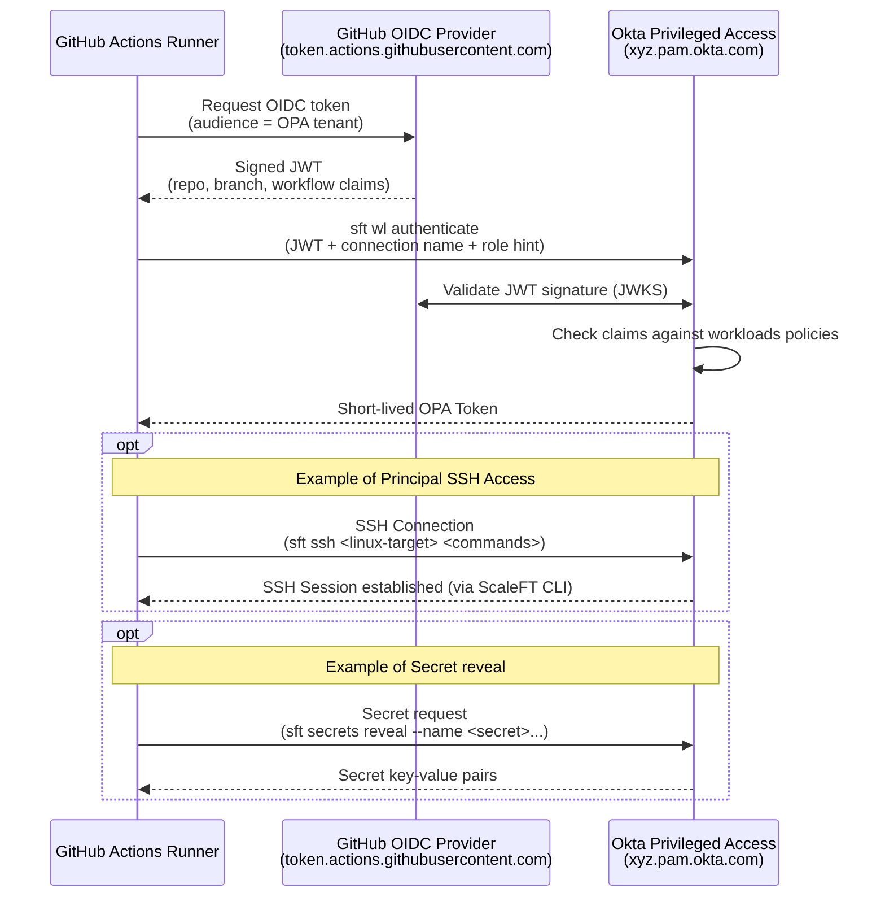
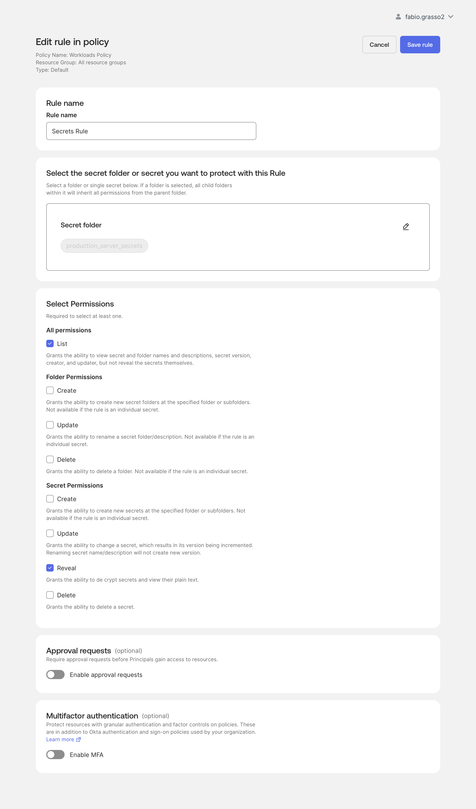

# Okta Privileged Access — Workloads Lab

> **Note**: This is a lab environment for testing and demonstration purposes.

> [!CAUTION]
> **Not an Official Okta Product** - This is an independent community project and is not an official Okta product. Use at your own risk and always test in a non-production environment first.

A GitHub Actions lab that demonstrates **OPA (Okta Privileged Access) Workloads** — the ability for non-human identities (CI/CD pipelines) to authenticate to OPA without static secrets, using GitHub's native OIDC token.

[](LICENSE)
[](https://github.com/features/actions)

## Table of Contents

- [Overview](#-overview)
  - [What is OPA Workloads?](#what-is-opa-workloads)
  - [Lab Goals](#lab-goals)
  - [Architecture](#architecture)
- [Prerequisites](#-prerequisites)
- [OPA Configuration](#-opa-configuration)
- [GitHub Actions Configuration](#-github-actions-configuration)
- [Workflows](#-workflows)
- [Expected Output](#-expected-output)
- [Troubleshooting](#-troubleshooting)
- [Resources](#-resources)

---

## Overview

### What is OPA Workloads?

OPA Workloads provides **secretless authentication** for non-human identities (NHIs) such as CI/CD runners, service accounts, and containers. Instead of storing a static API key in GitHub Secrets, the GitHub Actions runner presents a **platform-signed JWT** (OIDC token) to OPA. OPA validates it cryptographically and issues a short-lived bearer token.

This eliminates the **"secret zero" problem** — there is no bootstrap credential to manage, rotate, or leak.

### Lab Goals

| Goal | Workflow | Notes |
| ---- | -------- | ----- |
| ✅ Run an SSH test against a Linux target | [`opa-workloads-ssh-linux.yml`](.github/workflows/opa-workloads-ssh-linux.yml) | |
| ⏳ Reveal an OPA secret | [`opa-workloads-read-secret.off`](.github/workflows/opa-workloads-read-secret.off) | Not yet supported by OPA — file disabled, kept as reference |

### Architecture



---

## Prerequisites

- An **Okta Privileged Access** (OPA) tenant with Workloads feature enabled
- An **Okta admin account** with DevOps Admin + Security Admin roles
- A **GitHub repository** with Actions enabled
- The `sft` CLI is installed automatically by the workflow (Ubuntu runner required)

For faster and reusable automation runs, this lab can use the companion ScaleFT client container image:

```text
ghcr.io/fabiograsso/opa-scaleft-client:latest
```

The image is maintained in [`opa-scaleft-docker`](https://github.com/fabiograsso/opa-scaleft-docker) and provides a generic container with the OPA `sft` client preinstalled. Workloads is one use case; the same image can be reused for other OPA automations.

---

## OPA Configuration

The following objects must be configured in OPA **before** running the workflow.

### 1. Workload Connection (DevOps Admin)

Navigate to **Okta Privileged Access → Access → Workloads → Connections** and create a new connection:

| Field | Value / Example |
|-------|-------|
| **Provider** | Github Actions |
| **GitHub Org/Owner** | `xyz` your GitHub organization or user |
| **Connection name** | `github-actions` |
| **Token time to live (TTL)** | `15 minutes` *(default)*  |
| **JWKS URL** | `https://token.actions.githubusercontent.com/.well-known/jwks` *(default)* |
| **Required Claims** | `repository_owner EQUALS xyz` *(default)* |


#### Recommended GitHub OIDC claims

The workload connection validates claims from the GitHub Actions OIDC token. Start with a narrow rule for the lab repository, then adjust it for your environment.

| Scope | Claim | Operator | Example value | Notes |
|-------|-------|----------|---------------|-------|
| GitHub owner | `repository_owner` | Equals | `xyz` | Allows repositories owned by the `xyz` GitHub user or organization |
| One repository | `repository` | Equals | `xyz/okta-lab-workloads` | Restricts access to this lab repository |
| One branch | `ref` | Equals | `refs/heads/main` | Restricts access to workflow runs from the `main` branch |
| One workflow subject | `sub` | Equals | `repo:xyz/okta-lab-workloads:ref:refs/heads/main` | Combines repository and branch in one claim |

For a simple lab, use:

| Claim | Operator | Value |
|-------|----------|-------|
| `repository_owner` | Equals | `xyz` |
| `repository` | Equals | `xyz/okta-lab-workloads` |

For a stricter setup, add `ref = refs/heads/main` or use the full `sub` claim instead of separate repository/branch claims.

> After creation, the connection is in **Draft** status. A Security Admin must activate it before use.

### 2. Activate the Connection (Security Admin)

Set the connection status from **Draft → Active**. Wait ~5 minutes for propagation before running the workflow.

### 3. Workload Role (Security Admin)

Navigate to **Okta Privileged Access → Access → Workloads → Roles** and create a role bound to the connection above.


### 4. Policy Binding (Security Admin)

Create a policy under **Okta Privileged Access → Policies**:
- Add the workload role as principal under **Select Workload Roles**
- Do **not** enable MFA or Access Requests — a headless workload cannot respond to them
- Publish the policy


#### SSH Use Case: Server SSH Session Rule

For the supported SSH workflow, add a **Server SSH session rule** granting access to `opa-linux-target` (or your own target server). Optionally, enable the Gateway for SSH access if your target is behind a ScaleFT gateway.


#### Secret Reveal Use Case: Secret Rule (Future Only)

For the disabled Secret Reveal example, add a **Secret Rule** granting access to the `production_server_secrets` folder (or your own secret folder). This is documented for future readiness only: OPA Workload Principal access to `sft secrets reveal` is not yet supported.



---

## GitHub Actions Configuration

### Repository Variables

The workflows read configuration from **Actions Variables**. No static OPA secrets are required. Start with the common variables, then add only the variables for the use case you want to run.

#### Common Variables

These variables are used by both examples.

| Variable | Required | Description | Default / Example |
|----------|----------|-------------|-------------------|
| `OPA_ADDR` | Yes | OPA tenant URL | `https://xyz.pam.okta.com` |
| `SFT_TEAM` | Yes | OPA team name | `xyz` |
| `OPA_WORKLOAD_CONNECTION` | No | Name of the workload connection in OPA | `github-actions` |
| `OPA_WORKLOAD_ROLE` | No | Name of the workload role in OPA | `workload-role-1` |

#### SSH Workflow Variables

Use these for the supported SSH workflow: [`opa-workloads-ssh-linux.yml`](.github/workflows/opa-workloads-ssh-linux.yml).

| Variable | Required | Description | Default / Example |
|----------|----------|-------------|-------------------|
| `OPA_LINUX_TARGET` | No | Linux server name used for the SSH test | `opa-linux-target` |

#### Optional AWS Variables for SSH

These variables are only needed when the SSH target or gateway is protected by an AWS Security Group and you want the workflow to temporarily allow the current GitHub-hosted runner IP. See [AWS setup checklist](#aws-setup-checklist-step-by-step).

| Variable | Required for AWS mode | Description | Default / Example |
|----------|-----------------------|-------------|-------------------|
| `AWS_GROUP_ID` | Yes | AWS Security Group ID to update before SSH | `sg-0a1bc23d456e7890f` |
| `AWS_ROLE_TO_ASSUME` | Yes | AWS IAM role ARN assumed through GitHub OIDC | `arn:aws:iam::123456789012:role/GitHubActionsRoleForOPAGateway` |
| `AWS_REGION` | No | AWS region for the Security Group | `us-east-1` |
| `AWS_SECURITY_GROUP_PORT` | No | TCP port to open temporarily | `7234` |

The AWS Security Group auto-update runs only when both `AWS_GROUP_ID` and `AWS_ROLE_TO_ASSUME` are configured.

#### Secret Reveal Variables (Future Only)

These variables are documented for the disabled preview workflow: [`opa-workloads-read-secret.off`](.github/workflows/opa-workloads-read-secret.off). Secret Reveal through OPA Workload Principals is not currently supported.

| Variable | Required | Description | Default / Example |
|----------|----------|-------------|-------------------|
| `SECRET_RESOURCE_GROUP` | No | Resource group containing the secret folder | `production_servers` |
| `SECRET_PROJECT` | No | Project containing the secret folder | `secrets` |
| `SECRET_FOLDER` | No | Folder containing the target secret | `production_server_secrets` |
| `SECRET_NAME` | No | Secret name inside `SECRET_FOLDER` | `MySql_root` |

> [!WARNING]
> This lab workflow prints decoded GitHub OIDC token claims and decoded OPA token content when available. Use this only in a disposable lab to inspect claims and capabilities. Never copy this behavior into production workflows.

The SSH test runs against `OPA_LINUX_TARGET` and executes a few simple commands:

```bash
sft ssh "$OPA_LINUX_TARGET" --command 'hostname && uname -a && whoami'
```

### sft CLI setup

The SSH workflow is intentionally self-contained. The disabled Secret Reveal preview keeps the same shape for future use. Each example includes the OIDC, `sft` setup, and OPA Workloads authentication steps inline, even if that duplicates a little YAML. This makes the examples easier to read and copy:

- request and print decoded GitHub OIDC token claims
- install the `sft` CLI if it is not already available
- authenticate with `sft wl authenticate`
- print decoded OPA token content when the token is JWT-shaped

The workflow intentionally does **not** cache apt-installed `scaleft-client-tools`. Caching system packages on GitHub-hosted runners is fragile because package paths, permissions, dependencies, and runner images can drift. If startup time becomes a real issue, prefer a self-hosted runner or custom container image with `sft` preinstalled.

This lab references the companion [`opa-scaleft-docker`](https://github.com/fabiograsso/opa-scaleft-docker) image for that container-based approach:

```text
ghcr.io/fabiograsso/opa-scaleft-client:latest
```

### Set Environment Variables for GitHub Actions

#### Option A — GitHub CLI (recommended)

```bash
# 1. Copy the example file and fill in the two blank values
cp .env.example .env

# 2. Edit .env and set OPA_ADDR and SFT_TEAM.
#    Keep the other defaults unless your OPA lab uses different names.

# 3. Import all variables into the repository in one command
gh variable set --env-file .env
```

Verify the variables were imported:

```bash
gh variable list
```

#### Option B — GitHub UI

1. Go to your repository on GitHub
2. Click **Settings** → **Secrets and variables** → **Actions**
3. Select the **Variables** tab
4. Click **New repository variable** for each entry in the table above


---

## Workflows

This lab separates the supported SSH path from the future Secret Reveal path.

| Use case | Status | File |
|----------|--------|------|
| SSH to Linux target | Supported | [`opa-workloads-ssh-linux.yml`](.github/workflows/opa-workloads-ssh-linux.yml) |
| Secret Reveal | Future example only | [`opa-workloads-read-secret.off`](.github/workflows/opa-workloads-read-secret.off) |

### Supported: `opa-workloads-ssh-linux.yml`

Runs an SSH test against `OPA_LINUX_TARGET`, which defaults to `opa-linux-target`.

**Trigger:** Manual (`workflow_dispatch`) or on push to `main`

**Steps:**
1. Request a GitHub OIDC token.
2. Install the `sft` CLI from the Okta PAM apt repository if needed.
3. Authenticate to OPA with `sft wl authenticate`.
4. Execute sample commands on the Linux target:
   ```bash
   sft ssh "$OPA_LINUX_TARGET" --command 'hostname && uname -a && whoami'
   ```
5. If AWS auto-update is enabled, remove the temporary Security Group rule even if the SSH command fails.

### Future Only: `opa-workloads-read-secret.off`

> [!IMPORTANT]
> **Workloads support for Secret Reveal is included as an example but is not yet supported by OPA.**
> OIDC authentication via Workloads works for SSH (Principal SSH access), but `sft secrets reveal` is not yet available for Workload Principals — tokens return `Missing capability: secret_folder.item_list` or `Missing capability: secret.resolve`.
>
> The file has been renamed from `.yml` to `.off` so that GitHub Actions does not execute it, but the code is kept as a reference. This guide will be updated once the feature is supported by OPA.

When available, this workflow will reveal one OPA secret through Workloads authentication, using the folder configured by `SECRET_RESOURCE_GROUP`, `SECRET_PROJECT`, and `SECRET_FOLDER`. The file is already complete. When OPA supports this capability, renaming it back to `.yml` will make it executable again.

**Steps (preview):**
1. Request a GitHub OIDC token.
2. Install the `sft` CLI from the Okta PAM apt repository if needed.
3. Authenticate to OPA with `sft wl authenticate`.
4. Reveal the configured secret directly by folder path and secret name:
   ```bash
   sft secrets reveal --team "$SFT_TEAM" \
     --resource-group "$SECRET_RESOURCE_GROUP" \
     --project "$SECRET_PROJECT" \
     --path "$SECRET_FOLDER" \
     --name "$SECRET_NAME" \
     --output json
   ```

### Docker samples

The repository also includes two non-executable Docker examples:

| Sample file | Purpose |
|-------------|---------|
| [`opa-workloads-read-secret.sampledocker`](.github/workflows/opa-workloads-read-secret.sampledocker) | Shows the read-secret workflow using `ghcr.io/fabiograsso/opa-scaleft-client:latest` |
| [`opa-workloads-ssh-linux.sampledocker`](.github/workflows/opa-workloads-ssh-linux.sampledocker) | Shows the SSH workflow using `ghcr.io/fabiograsso/opa-scaleft-client:latest` |

These files are intentionally not named `.yml` or `.yaml`, so GitHub Actions will not run them. They are copyable examples for labs that prefer the prebuilt Docker image over installing `sft` during each run.

---

## Expected Output

**SSH workflow:**

```text
✅ sft installed: sft version X.Y.Z
✅ GitHub OIDC token obtained
✅ OPA bearer token obtained via workload authentication
🖥️ SSH target: opa-linux-target
Running: sample test commands on the target
wl_workload1
opa-linux-target
Linux opa-linux-target ...
✅ SSH test completed successfully
```

**Secret reveal workflow (when supported):**

```
✅ sft installed: sft version X.Y.Z
✅ GitHub OIDC token obtained
✅ OPA bearer token obtained via workload authentication

📁 Folder: production_server_secrets  (project: secrets, resource_group: production_servers)
   🔑 MySql_root
      username: ***
      password: ***
      host: ***

✅ OPA secret reveal completed successfully
```

---

## Optional AWS Security Group auto-update

If your Okta PAM / ScaleFT gateway or target VM is reachable through a public AWS address, the inbound Security Group may need to allow the current GitHub-hosted runner IP. GitHub-hosted runner IP ranges are dynamic and broad, so this lab supports an optional just-in-time allowlist flow for the SSH workflow:

1. Detect the current runner public IP.
2. Add a temporary `/32` inbound rule to the configured AWS Security Group.
3. Run the OPA Workloads SSH test.
4. Remove the temporary rule in a cleanup step with `if: always()`.

This is optional and is disabled by default. It runs only when `AWS_GROUP_ID` and `AWS_ROLE_TO_ASSUME` are configured:

| Variable | Required for AWS mode | Notes |
|----------|-----------------------|-------|
| `AWS_GROUP_ID` | Yes | Security Group ID to update |
| `AWS_ROLE_TO_ASSUME` | Yes | IAM role assumed by GitHub Actions through OIDC |
| `AWS_REGION` | No | Region containing the Security Group; defaults to `us-east-1` |
| `AWS_SECURITY_GROUP_PORT` | No | TCP port to open; defaults to `7234` |

> [!WARNING]
> Scope this to the minimum required Security Group and TCP port. Do not use this pattern to open broad network access, and never allow `0.0.0.0/0` for this lab.

The workflow uses [`aws-actions/configure-aws-credentials`](https://github.com/aws-actions/configure-aws-credentials) and GitHub OIDC. No long-lived AWS access keys are required.

### AWS setup checklist (step by step)

1. Create or identify the target Security Group
   - Go to `EC2 > Network & Security > Security Groups`.
   - Create or select the Security Group that must be updated temporarily during the workflow run.
   - Record:
     - Security Group ID (placeholder example: `sg-0a1bc23d456e7890f`)
     - AWS region (example: `us-east-1`)

2. Attach the Security Group to the target EC2 instance
   - Go to `EC2 > Instances`, select the target VM, then open `Security > Security groups > Edit`.
   - Add the Security Group from step 1 to the instance (or replace the current one, depending on your design).
   - Save and verify that the instance (or its ENI) is using that Security Group.
   - Ensure the workflow port is aligned with your service exposure:
     - default is `7234`
     - or set `AWS_SECURITY_GROUP_PORT` in GitHub Actions variables

3. Create (or verify) the GitHub OIDC identity provider in IAM
   - Go to `IAM > Identity providers > Add provider`.
   - Provider type: `OpenID Connect`
   - Provider URL: `https://token.actions.githubusercontent.com`
   - Audience: `sts.amazonaws.com`
   - If it already exists, reuse it.

4. Create a minimal IAM policy for only that Security Group
   - Go to `IAM > Policies > Create policy > JSON`.
   - Use a least-privilege policy like this:
    ```json
    {
      "Version": "2012-10-17",
      "Statement": [
        {
          "Effect": "Allow",
          "Action": [
            "ec2:AuthorizeSecurityGroupIngress",
            "ec2:RevokeSecurityGroupIngress",
            "ec2:CreateTags"
          ],
          "Resource": [
            "arn:aws:ec2:<region>:<account-id>:security-group/<security-group-id>",
            "arn:aws:ec2:<region>:<account-id>:security-group-rule/*"
          ]
        }
      ]
    }
    ```

   - Concrete placeholder example:

    ```json
    {
      "Version": "2012-10-17",
      "Statement": [
        {
          "Effect": "Allow",
          "Action": [
            "ec2:AuthorizeSecurityGroupIngress",
            "ec2:RevokeSecurityGroupIngress",
            "ec2:CreateTags"
          ],
          "Resource": [
            "arn:aws:ec2:us-east-1:123456789012:security-group/sg-0a1bc23d456e7890f",
            "arn:aws:ec2:us-east-1:123456789012:security-group-rule/*"
          ]
        }
      ]
    }
    ```

5. Create an IAM role for GitHub Actions (not EC2)
   - Go to `IAM > Roles > Create role`.
   - Trusted entity type: `Web identity`
   - Identity provider: `token.actions.githubusercontent.com`
   - Audience: `sts.amazonaws.com`
  - Attach the policy from step 4.
   - Example role ARN format:
     - `arn:aws:iam::123456789012:role/GitHubActionsRoleForOPAGateway`

6. Restrict the role trust policy to your repository
   - In the role, open `Trust relationships > Edit trust policy`.
   - Restrict by `aud` and `sub` (repo and optionally branch/environment).
   - Example:

    ```json
    {
      "Version": "2012-10-17",
      "Statement": [
        {
          "Effect": "Allow",
          "Principal": {
            "Federated": "arn:aws:iam::123456789012:oidc-provider/token.actions.githubusercontent.com"
          },
          "Action": "sts:AssumeRoleWithWebIdentity",
          "Condition": {
            "StringEquals": {
              "token.actions.githubusercontent.com:aud": "sts.amazonaws.com",
              "token.actions.githubusercontent.com:sub": "repo:xyz/okta-lab-workloads:ref:refs/heads/main"
            }
          }
        }
      ]
    }
    ```

7. Configure GitHub Actions variables in the repository
   - Go to `Settings > Secrets and variables > Actions > Variables`.
   - Required for AWS mode:
     - `AWS_GROUP_ID=sg-0a1bc23d456e7890f`
     - `AWS_ROLE_TO_ASSUME=arn:aws:iam::123456789012:role/GitHubActionsRoleForOPAGateway`
   - Optional:
     - `AWS_REGION=us-east-1`
     - `AWS_SECURITY_GROUP_PORT=7234`

8. Verify workflow permissions and run
   - Ensure the workflow keeps:
     - `permissions.id-token: write`
     - `permissions.contents: read`
   - Run `OPA Workloads - SSH Linux` and confirm these steps appear:
     - `Configure AWS credentials for temporary Security Group access`
     - `Allow current runner IP in AWS Security Group`
     - `Run SSH test`
     - `Remove current runner IP from AWS Security Group`

If your AWS policy validates request tags or rule tags, the workflow tags newly created Security Group rules with:

- `CreatedBy=GitHubActions`
- `Repository=<owner>/<repo>`
- `GitHubRunId=<run-id>`

---

## Troubleshooting

### Common OPA Workloads Issues

| Error | Likely Cause | Fix |
|-------|-------------|-----|
| `JWT validation failed` | JWKS URL or claim values mismatch | Verify `iss`, `aud`, `sub` in the workload connection config |
| `Connection not found` | Wrong value in `OPA_WORKLOAD_CONNECTION` variable | Match the variable to the exact connection name in OPA |
| `Connection is in Draft state` | Connection not activated by Security Admin | Security Admin must promote Draft → Active |
| `sft: command not found` | sft install step failed | Confirm the runner is Ubuntu |

### SSH and AWS Issues

| Error | Likely Cause | Fix |
|-------|-------------|-----|
| `Could not assume role with OIDC` | AWS trust policy does not match the repository, branch, or audience | Check the IAM role trust policy for GitHub Actions OIDC |
| `UnauthorizedOperation` from AWS CLI | IAM role lacks permission to update or tag the Security Group rule | Limit and grant `ec2:AuthorizeSecurityGroupIngress`, `ec2:RevokeSecurityGroupIngress`, and `ec2:CreateTags` for the target Security Group rule |
| SSH exits with `255` and no command output | Network path, gateway, Security Group, or OPA SSH policy issue | Check the `sft list-servers` output, AWS temporary rule logs, target SG attachment, and Server SSH session rule |

### Secret Reveal Current Limitation

| Error | Meaning | Fix |
|-------|---------|-----|
| `Missing capability: secret_folder.item_list` | Secret listing is not currently available for OPA Workload Principals | Expected for now; keep the `.off` workflow as reference |
| `Missing capability: secret.resolve` | Secret reveal is not currently available for OPA Workload Principals | Expected for now; this guide will be updated when OPA supports it |

---

## Resources

- [OPA Workloads Overview](https://help.okta.com/oie/en-us/content/topics/privileged-access/pam-workloads.htm)
- [Configure Workload Authentication](https://help.okta.com/oie/en-us/content/topics/privileged-access/pam-configure-workloads.htm)
- [Configure Workload Connection](https://help.okta.com/oie/en-us/content/topics/privileged-access/pam-configure-workload-connection.htm)
- [GitHub Actions OIDC Security Hardening](https://docs.github.com/en/actions/deployment/security-hardening-your-deployments/about-security-hardening-with-openid-connect)